# DLT and Epipolar Lines

The goal of this assignment is to aid your understanding of the Direct Linear Transform as well as Epipolar geometry.

For the first part of the assignment you will find correspondences between 2D-3D points and estimate the P Matrix. You will then be required to estimate Camera Parameters from this P matrix.

The second part of this assignment will require you to construct epipolar lines on two corresponding images.

The third part of this assignment will require you to use camera intrinsics to estimate the bounding box of a car.

---
### Generating Correspondences
The first step to perform DLT is to generate correspondences. The cell below opens a new window. Clicking anywhere on the image should give you the pixel location of the image. Once you're done clicking, close the image window. The cell after displays the points you have clicked.
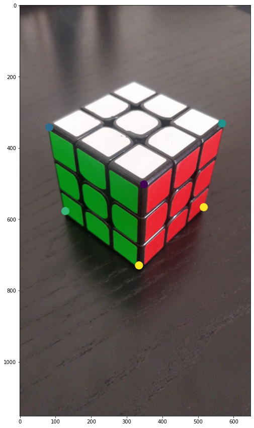

___

### Theory

- Explain how DLT is implemented and show why it works (proof)
- When does DLT fail?

#### <b> Theory Answers</b>
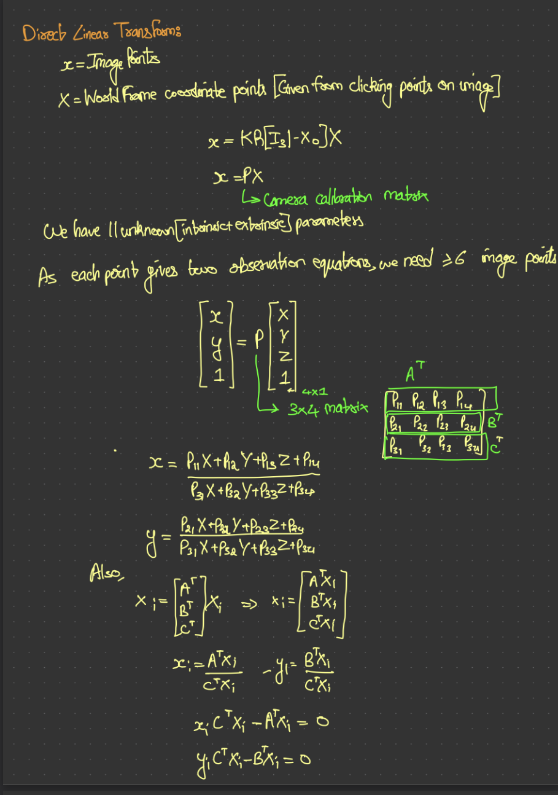
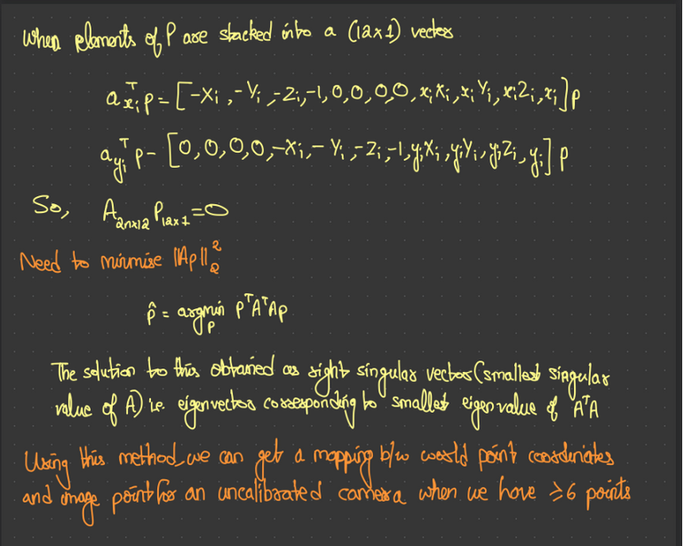

This works essentially because when we initially solve for linear equations of homogenous systems we use SVD of $Mp = 0$. But in case of redundant observations, Mp wont be exactly zero. 
So we equate it to a value and minimise it as low as possible. When SVD is applied, in the $USV^{T}$, $S$ is a diagonal matrix containing singular values in a descreasing order i.e Smallest singular value is in the last value of the matrix and the $V$ vector essetially corresponds to respective singular vector.  Therefore, **we pick the singular vector corresponding to smallest singular value** and assign it as solution of P to get $Mp$ value as small as possible.

## Zhangs method

For this task, use the inbuilt Opencv function to estimate the K matrix of a camera. Use the checkerboard images 5456-5470 in `q1/zhangs` folder for this task. Familiarize yourself with the different parameters for this method.

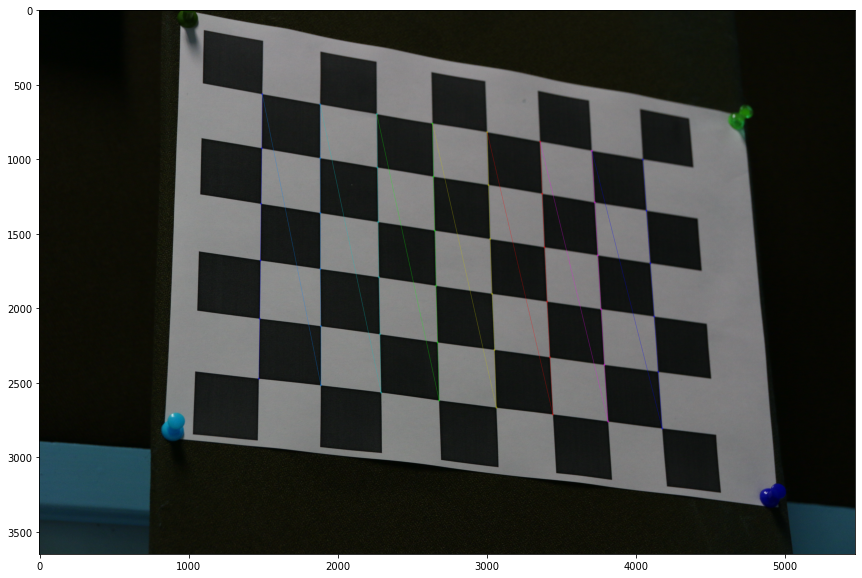

---
## Epipolar lines
#### Task 1

For this task, you have been given two images of the same scene taken from different view-points. You should first estimate the fundamental matrix from these two images.

Recall that given a point in one image, it's corresponding location in the other image can be found to along a line viz. the epipolar line. The task given to you is to draw the epipolar lines in the second image for each given point in the first image. You have to repeat this for the other image as well. Draw epipolar lines on the first image for the corresponding points in the second image.

The convention used for F is $x'^{T}Fx$ where $x'$ is the location of the point in the second image. For this question you will need to compute the F matrix on your own without using inbuilt functions. 

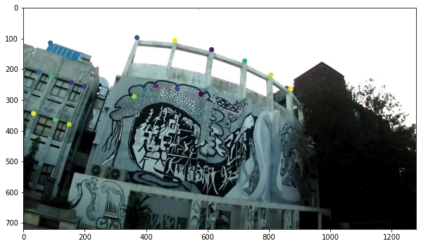
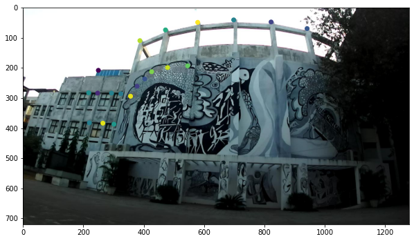
<b>Epipolar Lines</b>
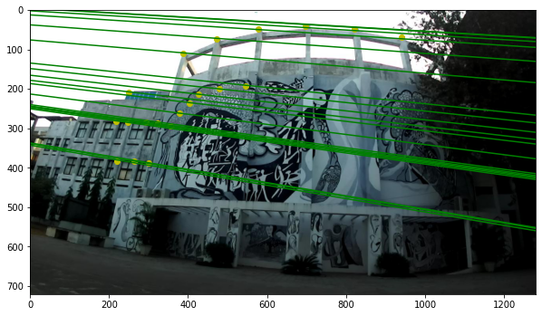
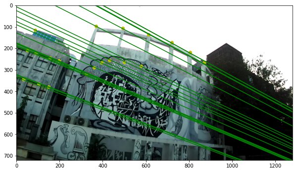

For finding the fundamental matrix F, we use the normalised 8-point algorithm on selected points

First we normalise the data to be origin centered and scale it so that the average distance of pixel from origin is $\sqrt{2}$

Hence the transform to be applied is given by 
$
T = \begin{bmatrix}
s & 0 & -s*t_x \\
0 & s & -s*t_y \\
0 & 0 & 0 \\
\end{bmatrix}$
Where $s = \dfrac{\sqrt{2}}{\text{std of pixels}}$ and $t_x,t_y$ are the mean values of the pixels

We apply the transforms $T_1,T_2$ respectively for the pixels in image-1 and image-2.

Now we find the matrix $W$ where each row of the matrix is given by $W_i = \begin{bmatrix}
u_1^i*u_2^i & u_1^i*v_2^i & u_1^i & v_1^i*u_2^i & v_1^i*v_2^i & v_1^i & u_2^i & v_2^i & 1 
\end{bmatrix}$ where $u_j^i,v_j^i$ are the x and y coordinates of image-j and pixel i

Our fundamental matrix can be obtained from W using SVD. 

$U*D*V^T = \text{SVD}(W)$ then $f = \text{last column of V}$

from $f$ we can obtain F since $f$ is just the elements of F stacked onto each other to form a column matrix. We can get F by reshaping $f$ into a 3x3 matrix.

To satisfy the condition of F being singular we do SVD on F

$U*D*V^T = \text{SVD}(F)$ then setting the final element of the diagonal matrix $D$ as zero and recomputing F, we can get the closest fundamental matrix to F that is singular.

$F^{\text{recomp}} = F = U*D^{\text{modified}}*V^T$

The above calculated F satisfies $x_1^TFx_2 = 0$ but the question requires it to be $x_2^TFx_1 = 0$. Taking the transpose of the equation we get the final F is the tranpose of currently calculated F. $(x_1^TFx_2)^T = x_2^TF^Tx_1 = 0 ==> F^\text{final} = F^T$

Now the epipolar lines can be calculated as $l_1 = F^Tx_2$, $l_2 = Fx_1$ where F is the fundamental matrix that we have found, $x_1,x_2$ are the pixel correspondences in the images

line equation is given by $l^Tx = 0$, ie. 
$
\begin{bmatrix}
l_1 & l_2 & l_3
\end{bmatrix} * 
\begin{bmatrix}
x  \\
y  \\
1  \\
\end{bmatrix} = 0$

Hence we get the equation $y = \dfrac{-l_1x-l_3}{l_2}$. we use this to plot the epipolar lines for each column of $l_1,l_2$ which corresponds to each epipolar lines.

### Task 2
Report the location of the epipoles. Mathematically find the epipoles and verify that the lines intersect at the epipole.

We know that epipole of image-1 will follow $F*e_1 = 0$. Hence $e_1$ lie in the right nullspace of F. 

$U*D*V^T = \text{SVD}(F)$

We know that columns of V form an orthonormal basis for the row space of F. Since F is rank deficient, the final singular value in the diagonal matrix D is zero. Hence the nullspace will contain the last column of V. Therefore the epipole $e_1$ will be the last column of V. We convert it back to euclidean space by dividing $e_1$ by the value in its last row to get the epipole in image-1

Similarly we know that $F^T*e_2 = 0$

$U*D*V^T = \text{SVD}(F^T)$

By the same reasoning as before the epipole $e_2$ will be the last column of V. We convert it back to euclidean space by dividing $e_2$ by the value in its last row to get the epipole in image-2

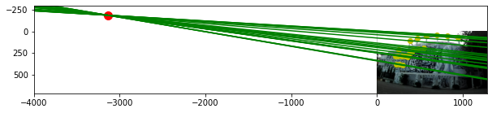
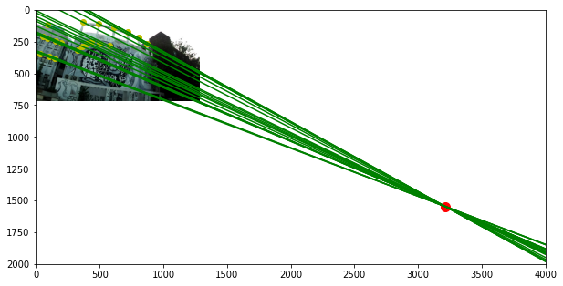

____
### 4.3 Drawing a bounding box around a car and localizing it in the camera frame
You’ve been provided with an image, also taken from a self-driving car, that shows another car in front. The camera has been placed on top of the car, 1.65 m from the ground, and assume the image plane is perfectly perpendicular to the ground. K is provided to you. Your task is to draw a 3D-bounding box around the car in front as shown. Your approach should be to place eight points in the 3D world such that they surround all the corners of the car, then project them onto the image, and connect the projected image points using lines. You might have to apply a small 5° rotation about the vertical axis to align the box perfectly. Rough dimensions of the car - h: 1.38 m, w: 1.51, l: 4.10. (Hint: Fix a point on the ground as your world origin.). Also estimate the approximate translation vector to the mid-point of the two rear wheels of the car in the camera frame.

<b>Output:</b>
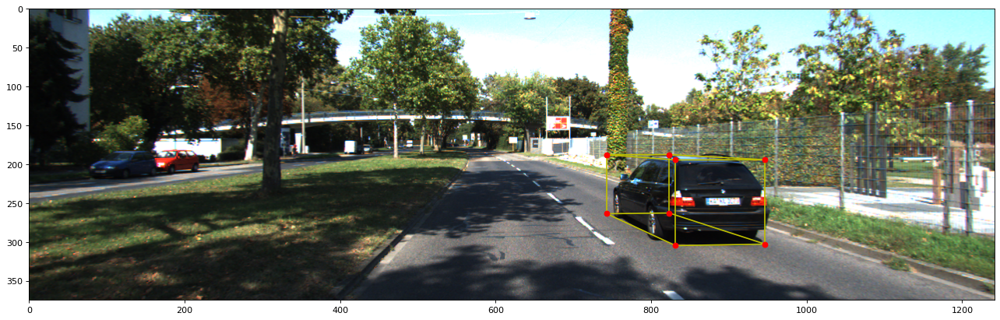